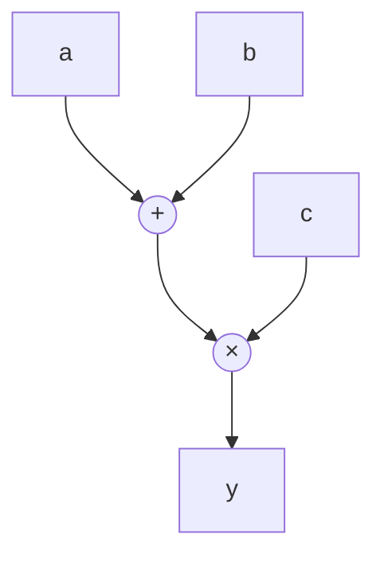

---
aliases:
  - Computation Graph AD
  - AD Graphs
  - Dynamic vs Static Graphs
---

# Computation Graphs for Automatic Differentiation

Computation graphs are directed acyclic graphs (DAGs) that represent mathematical operations performed in a program. They serve as the foundational data structure for [[Automatic Differentiation in ML|automatic differentiation]] systems, enabling efficient derivative calculation through systematic application of the chain rule.

## Fundamental Principles

### Graph Structure

A computation graph consists of:

- **Nodes**: Represent variables (inputs, parameters, intermediate values, outputs)
- **Edges**: Represent operations (elementary functions) that transform input nodes to output nodes
- **Topological Ordering**: Operations are ordered such that each node's inputs are computed before the node itself

### Example Graph

For the function $y = (a+b) \times c$:



Each node stores:
1. The operation to perform
2. References to input nodes
3. During computation: the resultant value (and potentially, derivative information)

## Role in AD Systems

### Function Evaluation (Forward Pass)

The computation graph enables systematic function evaluation through:

1. **Topological Traversal**: Process nodes in order such that all inputs to a node are calculated before the node itself
2. **Value Propagation**: Compute and store values at each node based on operation and input values
3. **Output Extraction**: Return the value at the designated output node(s)

This process corresponds to the [[Forward Primal Trace]] in AD terminology.

### Gradient Computation

The graph structure facilitates both major AD modes:

#### [[Forward Mode Automatic Differentiation]]

1. Augments the forward computation to simultaneously track derivatives
2. At each node, computes both the value and its derivative with respect to inputs
3. Propagates derivative information alongside values through the graph
4. Often implemented using [[Dual Numbers and Forward AD|dual numbers]]

```python
# Conceptual implementation
def forward_ad_node(operation, inputs, tangents):
    # Compute primal (value)
    primal = operation(*[x.primal for x in inputs])
    
    # Compute tangent (derivative)
    tangent = sum(op_gradient(i, inputs) * inputs[i].tangent 
                  for i in range(len(inputs)))
    
    return DualNumber(primal, tangent)
```

#### [[Reverse Mode Automatic Differentiation]]

1. First performs a complete forward pass (storing values at each node)
2. Then performs a [[Reverse Adjoint Trace]] backward from outputs to inputs:
   - Initialize adjoints at output nodes (typically 1 for loss function)
   - Propagate adjoints backward through the graph
   - For each node, distribute its adjoint to its input nodes using local derivatives

```python
# Conceptual implementation
def backward_pass(graph):
    # Initialize output adjoints
    graph.output_node.adjoint = 1.0
    
    # Process nodes in reverse topological order
    for node in reversed(graph.topological_order):
        # For each input to this node
        for input_node in node.inputs:
            # Compute local derivative
            local_derivative = node.operation.gradient(input_node)
            
            # Accumulate adjoint at input node
            input_node.adjoint += node.adjoint * local_derivative
```

## Graph Construction Paradigms

The way computation graphs are built fundamentally shapes ML frameworks and compiler systems.

### Static Graphs

Static graphs are defined before computation begins and remain fixed during execution.

#### Characteristics

- **Declarative Definition**: Graph structure explicitly defined before computation
- **Compilation Step**: Graph undergoes compilation and optimization before execution
- **Execution Phase**: Optimized graph executed with different input values
- **Separation of Definition and Execution**: Graph definition is distinct from its execution

#### Implementation in ML Frameworks

- **TensorFlow 1.x**: The original Graph API requires explicit graph construction
- **JAX with `@jit`**: Functions decorated with `@jit` are traced once, then compiled
- **TensorFlow's `tf.function`**: Captures Python code into a static graph representation
- **PyTorch with TorchScript**: Traces dynamic PyTorch operations into a static graph

```python
# TensorFlow 1.x static graph
import tensorflow as tf1
tf1.reset_default_graph()

# Define graph
a = tf1.placeholder(tf1.float32, shape=[], name="a")
b = tf1.placeholder(tf1.float32, shape=[], name="b")
c = tf1.placeholder(tf1.float32, shape=[], name="c")
sum_ab = tf1.add(a, b)
result = tf1.multiply(sum_ab, c)

# Execute graph with different values
with tf1.Session() as sess:
    print(sess.run(result, {a: 1.0, b: 2.0, c: 3.0}))  # 9.0
    print(sess.run(result, {a: 4.0, b: 5.0, c: 6.0}))  # 54.0
```

#### Compiler Optimizations

Static graphs enable powerful compiler-level optimizations:

1. **Operation Fusion**: Combining multiple operations into a single kernel
2. **Constant Folding**: Pre-computing operations with constant inputs
3. **Common Subexpression Elimination**: Identifying and reusing repeated computations
4. **Layout Optimizations**: Selecting optimal memory layouts for tensors
5. **Memory Planning**: Pre-allocating memory and minimizing memory footprint
6. **Parallel Execution Planning**: Identifying operations that can execute in parallel

### Dynamic Graphs

Dynamic graphs are built on-the-fly during program execution.

#### Characteristics

- **Imperative Definition**: Graph structure emerges from executing operations directly
- **No Pre-compilation**: Operations execute immediately when encountered
- **Recording Mechanism**: Operations are recorded (usually on a tape) for potential backward passes
- **Unified Definition and Execution**: Graph definition occurs concurrently with execution

#### Implementation in ML Frameworks

- **PyTorch**: The default paradigm builds a dynamic autograd graph during execution
- **TensorFlow (Eager mode)**: Operations execute immediately, and a tape records dependencies
- **Flux.jl**: Julia-based ML framework with dynamic graph construction

```python
# PyTorch dynamic graph
import torch

# Define variables
a = torch.tensor(1.0, requires_grad=True)
b = torch.tensor(2.0, requires_grad=True)
c = torch.tensor(3.0, requires_grad=True)

# Execute operations (graph built implicitly)
sum_ab = a + b
result = sum_ab * c

# Backpropagation
result.backward()

# Access gradients
print(a.grad)  # 3.0
print(b.grad)  # 3.0
print(c.grad)  # 3.0
```

#### Tracing to Static Graphs

Many frameworks provide mechanisms to convert dynamic execution to static graphs:

- **PyTorch JIT**: Traces Python code into a static TorchScript representation
- **TensorFlow `tf.function`**: Captures eager code into a static graph
- **JAX `jit`**: Traces a function's execution to produce an XLA computation

```python
# PyTorch dynamic to static conversion
import torch

@torch.jit.script
def compute(a, b, c):
    sum_ab = a + b
    result = sum_ab * c
    return result

# The function is now compiled to a static graph
traced_result = compute(torch.tensor(1.0), 
                        torch.tensor(2.0), 
                        torch.tensor(3.0))
```

## Computation Graph Optimizations

### AD-Specific Graph Optimizations

1. **Checkpointing**: Strategically discard and recompute intermediate values to reduce memory
2. **In-place Operations**: Reuse memory for operations that can safely modify inputs
3. **Kernel Selection**: Choose specialized differentiation kernels (e.g., conv2d_backward)
4. **Expression Simplification**: Simplify derivative expressions algebraically
5. **Zero Elimination**: Skip computation paths with zero derivatives
6. **Redundancy Elimination**: Identify and merge common subexpressions in the backward pass

### Memory Management

Computation graphs often dominate memory usage in large models:

- **Graph Structure**: Storing the graph structure (nodes, edges, operations)
- **Intermediate Values**: Storing activation values needed for the backward pass
- **Gradient Accumulation**: Storing partial and accumulated gradients
- **Persistent vs. Non-persistent**: Some frameworks discard the graph after one backward pass

### Visualization and Debugging

Computation graphs can be visualized to aid understanding and debugging:

- **TensorBoard**: Visualizes TensorFlow graphs
- **PyTorch Profiler**: Shows execution traces of forward and backward passes
- **Netron**: Visualizes common ML model formats
- **JAX debugging tools**: Help inspect JIT-compiled functions

## Graph Representations in Compilers

### Internal Representations

Compilers typically transform computation graphs through multiple representations:

1. **Framework-specific Graph**: Initial representation in the ML framework
2. **Intermediate Representation (IR)**: Framework-independent representation
3. **Hardware-specific IR**: Adapted for target hardware

For example, JAX's transformation pipeline:
- Python function → jaxpr → XLA HLO → Hardware-specific code

### AD Integration in the Compiler Stack

Modern ML compilers integrate AD deeply into their compilation pipeline:

1. **Differentiation Primitive Registration**: Elementary operations register their derivatives
2. **Transformation Passes**: Compiler passes specifically for optimizing gradients
3. **Gradient Accumulation Optimization**: Special handling for the gradient accumulation pattern
4. **AD-specific Lowering Rules**: Special rules for mapping AD operations to hardware primitives

### Hardware-Aware Graph Transformations

Advanced compiler optimizations consider hardware characteristics:

- **Memory Hierarchy Awareness**: Optimizing for different memory levels (registers, cache, RAM)
- **Tensor Core Utilization**: Scheduling operations to use specialized Tensor Cores
- **Transfer Minimization**: Reducing data movement between CPU and accelerators
- **Parallel Execution**: Distributing computation across multiple devices

## Advanced Concepts

### Higher-Order Derivatives

Computation graphs can support higher-order derivatives through:

1. **Nested AD**: Applying AD transformations repeatedly
2. **Graph Transformation Composition**: Composing multiple derivative transformations
3. **Forward-over-Reverse/Reverse-over-Forward**: Mixing forward and reverse mode for efficiency

### Controlling Gradient Flow

Modern frameworks allow fine-grained control over gradient propagation:

- **Stop-gradient**: Preventing backpropagation through certain paths
- **Detach/no_grad**: Isolating parts of the computation
- **Custom Gradients**: Defining specialized gradient rules

```python
# PyTorch gradient flow control
x = torch.tensor(2.0, requires_grad=True)
with torch.no_grad():
    y = x * 3  # No gradient tracked
z = y + x      # Gradient tracked only for x in this operation
```

### Just-In-Time Derivative Code Generation

Advanced systems generate specialized derivative code at runtime:

- **Staged Computation**: Generating optimized derivative code during compilation
- **Symbolic Preprocessing**: Simplifying derivative expressions before code generation
- **Target-specific Optimization**: Generating different code for different hardware targets

## Integration with Other ML Compiler Components

### Interaction with [[Vectorization and Parallelization]]

- **Vectorized Derivatives**: Computing derivatives for multiple samples in parallel
- **Data Parallelism**: Distributing gradient computation across devices
- **Model Parallelism**: Partitioning the computation graph across devices

### Connection to [[Just In Time Compilation]]

- **Derivative Specialization**: Generating specialized gradient code for specific input shapes
- **Trace-based Optimization**: Using execution traces to optimize gradient computation
- **Kernel Fusion**: Combining multiple gradient operations into optimized kernels

## Conclusion

Computation graphs form the backbone of modern AD systems, enabling efficient derivative calculation essential for training neural networks. The distinction between static and dynamic graphs represents a fundamental design choice in ML frameworks, each with its own trade-offs. As ML models grow larger and more complex, compiler-level optimizations of computation graphs become increasingly critical for training efficiency and hardware utilization. Understanding these concepts is essential for anyone working on ML framework development, compiler optimization, or high-performance ML systems.

---

**References**:
1. Baydin, A. G., et al. (2018). Automatic differentiation in machine learning: a survey. *Journal of Machine Learning Research*, *18*, 1-43.
2. Paszke, A., et al. (2019). PyTorch: An imperative style, high-performance deep learning library. *NeurIPS 2019*.
3. Abadi, M., et al. (2016). TensorFlow: A system for large-scale machine learning. *OSDI 2016*.
4. Bradbury, J., et al. (2018). JAX: composable transformations of Python+NumPy programs. *GitHub*.
5. Wang, F., et al. (2021). Demystifying differentiable programming: shift/reset the penultimate backpropagator. *POPL 2021*. 